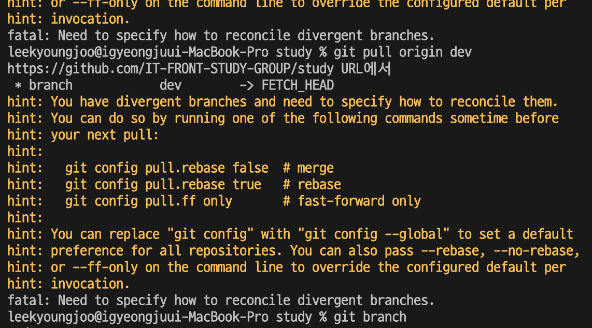

# git 협업

1. 팀장 : git organizations 생성
2. 팀장 : git repository 생성 및 dev 브랜치 생성 후 push
3. 작업자 : git clone 이후 dev 브랜치 생성 및 pull 이후 작업 브랜치 생성
4. 작업자 : 작업 브랜치 푸시 이후 PR 생성
5. 팀원 : PR 리뷰 작성
6. 작업자 : merge 실행 후 작업 브랜치 삭제

- 충돌 발생 시 충돌이 발생한 브랜치 동기화 이후 머지 실행

## 질문 사항

- 충돌 해결을 위해서 git merge dev가 아닌 git pull origin dev로 하였을 때 아래 오류 발생 원인
