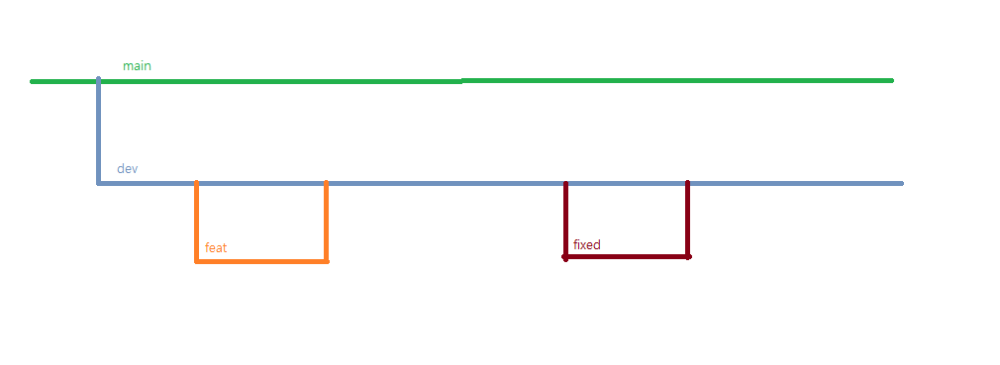
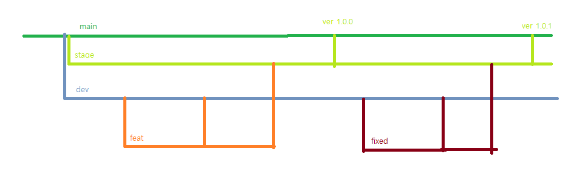

# git hub 협업

### 1팀

- 팀장 역할 : 박준규님
- 팀원 역할 : 이경주님, 김희라님, 박희재님

### 2팀

- 팀장 역할 : 김민준님
- 팀원 역할 : 백순흠님, 그레이스님, 김지훈님

---

## 동아리 활동 내용

### github 협업 플로우 및 독서 동아리 계획 논의

- 독서 동아리 전원 참석
- 책 : js deep dive

&nbsp;

&nbsp;

---

## 질문사항

### git 협업 플로우에서 main(master) 브랜치에 소스가 병합되는 시점 (지훈님)

기존 협업 플로우

예상 협업 플로우

