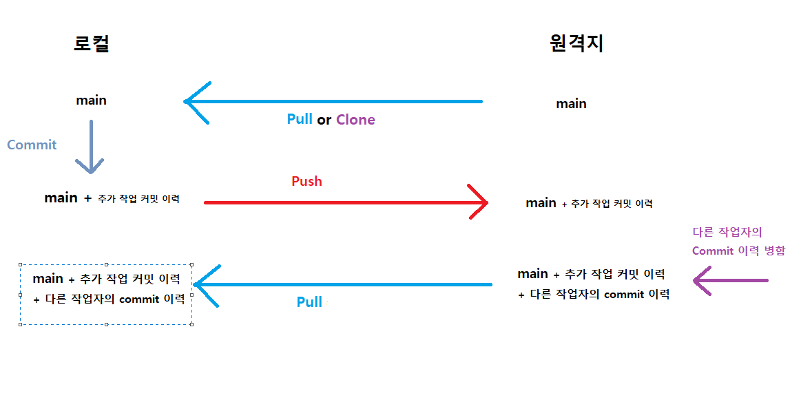

# git 정리

1. clone 혹은 init 이후 pull을 하여 동기화한다.
2. commit을 할 경우 로컬에 커밋 이력이 쌓인다.
3. push를 통해서 원격지에 로컬 작업 내용(commit 이력 포함)을 밀어넣는다.
4. 다른 작업자가 밀어넣은 작업 내용, 커밋 이력을 로컬에 동기화하기 위해서 pull을 받는다.
   

- merge는 서로 다른 브랜치를 합치거나 로컬, 원격지의 브랜치를 동기화할때 하는 작업(push, pull은 merge가 포함된 작업)
